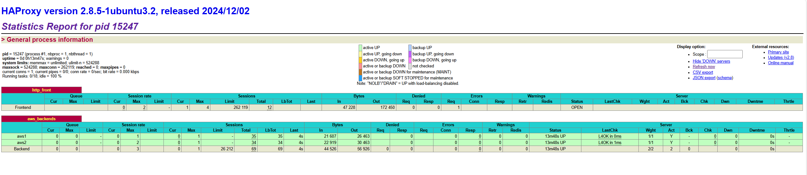

# Project 2: High-Availability Portfolio with OAuth and GitHub

## Part 1:  
In this part, I secured my portfolio using the NextAuth library and added a GitHub contribution bar with a CDN.

To secure my portfolio, first I installed NextAuthJS using the command:  
```bash
npm install next-auth
```

I created a file in `app/api/[...nextauth]` and an `Auth route.tsx` file to define what provider (third-party OAuth) I would use.

In `option.ts` I included the following content:

```typescript
...
        OsuProvider({
            clientId: process.env.OSU_ID as string,
            clientSecret: process.env.OSU_SECRET as string,
        }),
        DiscordProvider({
            clientId: process.env.DISCORD_ID as string,
            clientSecret: process.env.DISCORD_SECRET as string,
        }),
        GitHubProvider({
            clientId: process.env.GITHUB_ID as string,
            clientSecret: process.env.GITHUB_SECRET as string,
        }),
        BattleNetProvider({
            clientId: process.env.BATTLENET_ID as string,
            clientSecret: process.env.BATTLENET_SECRET as string,
            issuer: "https://us.battle.net/oauth"
        })
...
```

This defines that I used the providers BattleNet, GitHub, OSU, and Discord.

However, before I added the providers, I needed to go to their websites, create applications, and get the Client ID and Client Secret from the third-party websites.

After defining all the providers, I created a file called `middleware.ts`, which NextAuth uses to enforce all users who enter the website to log in using one of the options I provided (all providers).

Done! I created a sign-in option using NextAuth with third-party providers.

Next, I installed the GitHub contribution element using this CDN:  
```text
https://cdn.jsdelivr.net/gh/imananoosheh/github-contributions-fetch@latest/github_calendar_widget.js
```

I added the element that acts as a GitHub contribution bar:
```typescript
<div id="calendar-component" username="Getmeoutt" theme-color="#818cf8" background-color="#141311"></div>
```

Done! I successfully added the GitHub contribution bar.

## Part 2

### HAProxy configuration file with explanations

I set up my portfolio using two backend servers to serve content and one load balancer as a reverse proxy (HAProxy).

1. On the reverse proxy EC2, install HAProxy using the command:
```bash
sudo apt install haproxy -y
```

2. Configure HAProxy with AWS backend servers. Open the HAProxy configuration file:

```haproxy
global
        log /dev/log    local0
        log /dev/log    local1 notice
        chroot /var/lib/haproxy
        stats socket /run/haproxy/admin.sock mode 660 level admin
        stats timeout 30s
        user haproxy
        group haproxy
        daemon

        # Default SSL material locations
        ca-base /etc/ssl/certs
        crt-base /etc/ssl/private

        # See: https://ssl-config.mozilla.org/#server=haproxy&server-version=2.0.3&config=intermediate
        ssl-default-bind-ciphers ECDHE-ECDSA-AES128-GCM-SHA256:ECDHE-RSA-AES128-GCM-SHA256:ECDHE-ECDSA-AES256-GCM-SHA384:ECDHE-RSA-AES256-GCM-SHA384:ECDHE-ECDSA-CHACHA20-POLY1305:ECDHE-RSA-CHACHA20-POLY1305:DHE-RSA-AES128-GCM-SHA256:DHE-RSA-AES256-GCM-SHA384
        ssl-default-bind-ciphersuites TLS_AES_128_GCM_SHA256:TLS_AES_256_GCM_SHA384:TLS_CHACHA20_POLY1305_SHA256
        ssl-default-bind-options ssl-min-ver TLSv1.2 no-tls-tickets

defaults
        log     global
        mode    http
        option  httplog
        option  dontlognull
        timeout connect 5000
        timeout client  50000
        timeout server  50000
        errorfile 400 /etc/haproxy/errors/400.http
        errorfile 403 /etc/haproxy/errors/403.http
        errorfile 408 /etc/haproxy/errors/408.http
        errorfile 500 /etc/haproxy/errors/500.http
        errorfile 502 /etc/haproxy/errors/502.http
        errorfile 503 /etc/haproxy/errors/503.http
        errorfile 504 /etc/haproxy/errors/504.http

frontend http_front
    bind *:80
    default_backend aws_backends
    stats uri /haproxy?stats

backend aws_backends
    balance roundrobin
    server aws1 52.91.62.232:3000 check # this is my backend 1 IP address
    server aws2 35.174.136.188:3000 check # this is my backend 2 IP address
```

As you can see in the file, I use the round-robin algorithm.

If you access my website at the route `/haproxy?stats`, you can see the status page of each backend.

And since on the backend my page is hosted on port 3000, HAProxy proxies from port 3000.

3. Restart HAProxy:  
```bash
sudo systemctl restart haproxy
```

Done!

### Testing results showing traffic distribution

To test my HA load balancer, I kept reloading the page ([tom.nsripan.me](https://tom.nsripan.me/haproxy?stats)), which updates the status page to show the traffic being redirected.



## Part 3

### Testing portfolio

I tested my portfolio using `apache2-utils` with:

- Total Requests: 10,000  
- Concurrency Level: 1,000 (very high)

**Result:**

```
Server Software:
Server Hostname:        localhost
Server Port:            80

Document Path:          /
Document Length:        32 bytes

Concurrency Level:      1000
Time taken for tests:   9.268 seconds
Complete requests:      10000
Failed requests:        0
Non-2xx responses:      10000
Total transferred:      1670000 bytes
HTML transferred:       320000 bytes
Requests per second:    1078.93 [#/sec] (mean)
Time per request:       926.846 [ms] (mean)
Time per request:       0.927 [ms] (mean, across all concurrent requests)
Transfer rate:          175.96 [Kbytes/sec] received

Connection Times (ms)
              min  mean[+/-sd] median   max
Connect:        0    3  10.2      0      43
Processing:    27  854 226.1    812    3043
Waiting:        6  854 227.5    812    3043
Total:         48  858 224.8    813    3043

Percentage of the requests served within a certain time (ms)
  50%    813
  66%    904
  75%    961
  80%    986
  90%   1114
  95%   1287
  98%   1392
  99%   1450
 100%   3043 (longest request)
```

### Summary:

- Total Requests: 10,000  
- Concurrency Level: 1,000 (very high)  
- Time Taken: 9.268 seconds  
- Requests/sec: 1,078.93  
- Failed Requests: 0  
- Longest Request: 3,043 ms (~3 sec)

I simulated 10,000 HTTP requests to the HAProxy-managed portfolio using ApacheBench (`ab`) with a concurrency of 1,000. The system handled the load successfully with 0 failed requests. The average response time was under 1 second, and 95% of requests were served within 1.3 seconds. This test confirms the high availability and reliability of the load-balanced architecture.

---

**DONE** — you can access my website using the following URL:  
[https://tom.nsripan.me](https://tom.nsripan.me/)
